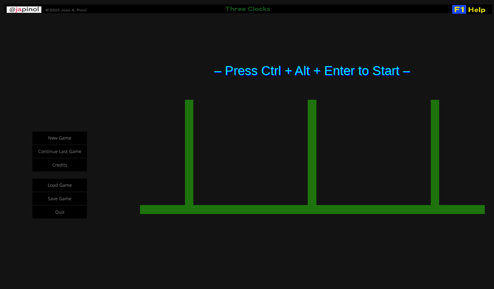
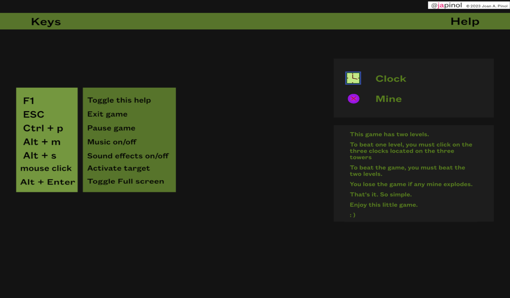
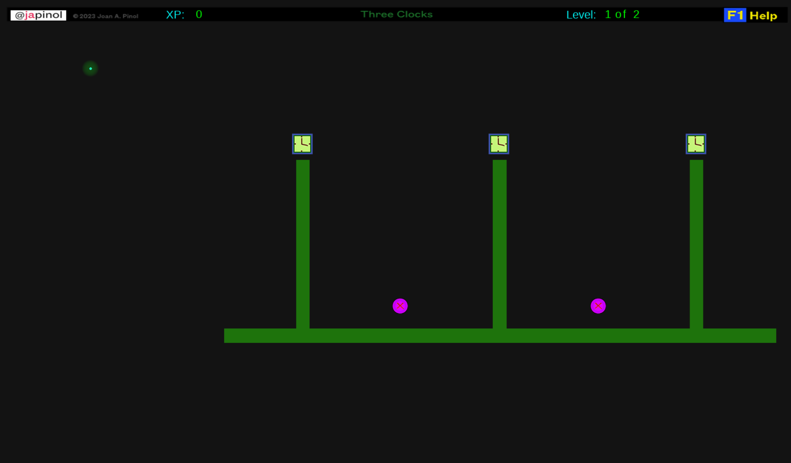
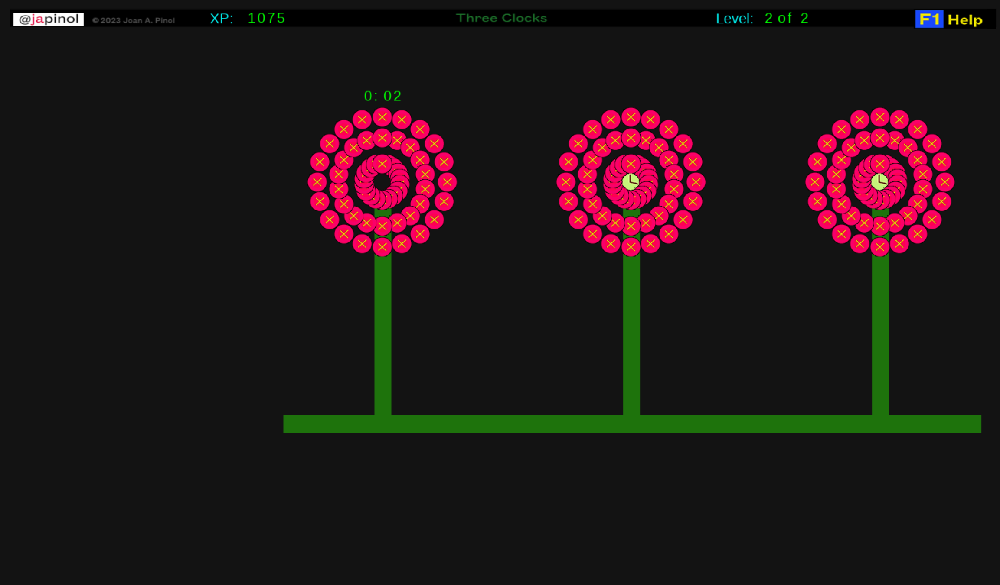

## Three Clocks
    This is a very minimal game example.
    This game has two levels.
    To beat one level, you must click on the three clocks 
    located on the three towers.
    To beat the game, you must beat the two levels. 
    You lose the game if any mine explodes.
    That's it. So simple.
 

	program: Three Clocks.
    name as a package: threeclocks 
	version: 1.0.0
	author: Joan A. Pinol
	author_nickname: japinol
	author_gitHub: japinol7
	author_twitter: @japinol
 

	Dependencies: pygame-ce, pygame-gui.
	Python requires: 3.13 or greater.
 

	Licenses: 
      (c) Joan A. Pinol 2023, 2024, 2025.
      The source code for this game is licensed under the MIT License.
      Note that the artwork, story, music, and sound effects are 
      not covered in the MIT license for this game and may 
      not be repurposed, redistributed, modified, or used in 
      any other way that the playback during execution of the 
      original game.
      More info about licenses here:
        > LICENSE.txt
        > LICENSE_ARTWORK.txt

## Screenshots

    
    
    
   
 

## Keyboard keys
    F1:     show a help screen while playing the game
    ESC:    exit the program
    Alt + Enter: toggle full screen
    ^p:     toggle pausing the game
    ^h:     shows this help to the console
 

## Usage

	threeclocks  usage: threeclocks [-h] [-f] [-l] [-m] [-n] [-uu] [-d] [-t]
	
    optional arguments:
     -h, --help, 	show this help message and exit
     -f, 	--fullscreen
            Full screen display activated when starting the game
     -l, 	--multiplelogfiles
            A log file by app execution, instead of one unique log file
     -m, 	--stdoutlog
            Print logs to the console along with writing them to the 
            log file
     -n, 	--nologdatetime
            Logs will not print a datetime.
     -uu, 	--nodisplayscaled
            Deactivate the scaling of the game screen. 
            Resolution depends on desktop size and scale graphics. 
            Note that Pygame scaled is considered an experimental API 
            and is subject to change.
            In most systems, it is better to have the scaling activated 
            when using the full screen display mode. 
     -d, 	--debug
            debug actions, information and traces
            This does not set the log level to debug. 
            Use the key shortcut ^ L_Alt + numpad_divide 
            to toggle log levels.
     -t, 	--debugtraces
            show debug back traces information when something goes wrong
   

**Default optional arguments**

	fullscreen          False
	multiplelogfiles    False
	stdoutlog           False
	nologdatetime       False
	nodisplayscaled     False
	debug               False
	debugtraces         False
   

**Examples of usage**

    > Run program:
       $ python -m threeclocks
   

**To make Three Clocks work**

	Do this:
	    1. Clone this repository in your local system.
	    2. Go to its folder in your system.
	    3. $ pip install -r requirements.txt
	    4. $ python -m threeclocks
